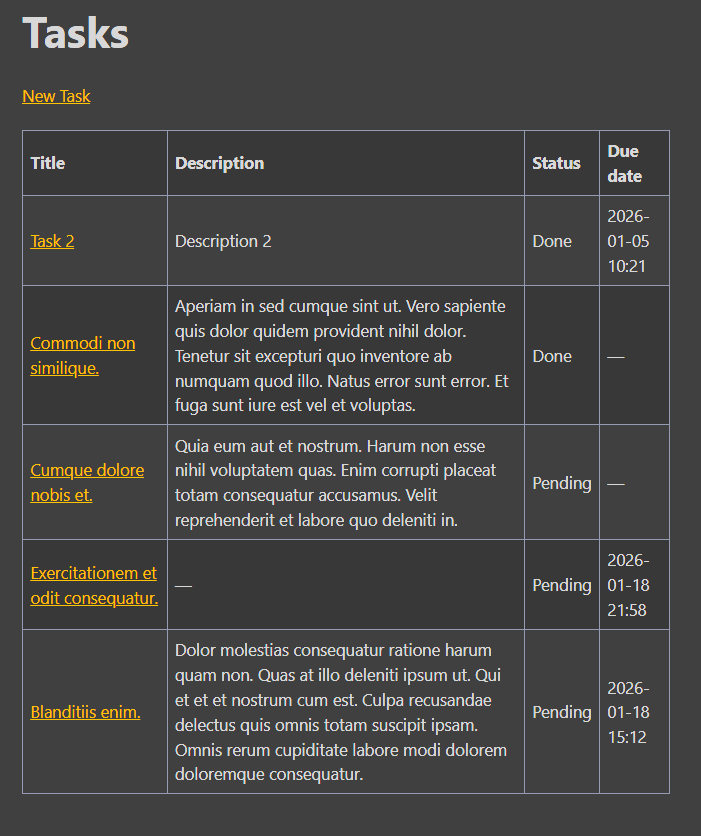

# Symfony ToDo App

Simple CRUD ToDo web application built with Symfony.

## Purpose
This project was created as a learning exercise to practice:
- Symfony routing and controllers
- Doctrine entities and repositories
- Symfony Forms and validation
- Basic CRUD application structure

## Features
- Create, edit, delete tasks
- Toggle task status (done / pending)
- Task details view
- Validation (required title, date constraints)
- Doctrine ORM
- Symfony Forms
- Fixtures for test data

## Tech stack
- PHP 8+
- Symfony
- Doctrine ORM
- Twig
- MySQL
